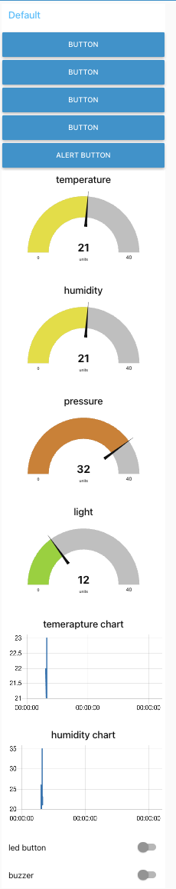

# a14g-final-submission

    * Team Number: 03
    * Team Name: Outdoor Innovators
    * Team Members: Jinnan Weng, Jinyu Tan
    * Github Repository URL: https://github.com/ese5160/a14g-final-submission-t03-outdoor-innovators
    * Description of test hardware: (development boards, sensors, actuators, laptop + OS, etc) Customed PCBA, sensors,  actuators

## 1. Video Presentation
https://drive.google.com/file/d/1mBNG53yQCwf-wDcMPQ2UYusR2cHMgMRF/view?usp=sharing

## 2. Project Summary

## 3. Hardware & Software Requirements
Hardware requirements:
HRS 01 - Microcontroller Core : The project shall be centered around the SAM W25 microcontroller, which provides Wi-Fi connectivity and robust data processing capabilities for handling sensor inputs and controlling output devices. Connection: SPI/I2C/UART, Voltage: 3.3V

As is shown in project photos, our customed PCBA use SAM W25 as our MCU. This requirement is met.

HRS 02 - Proximity Detection : PIR motion sensor RE200B shall be used for detecting the proximity of individuals, triggering the buzzer. 

This function has been demonstrated in the Video Presentation part. At 1:13 to 1:16 of the video, I demonstrate that the buzzer will make a sound when a hand is passed over the PIR sensor. It demonstartes that the above requirement is met.

HRS 03 - Ambient Light Adjustment- The Ambient Light Sensor VEML6030 shall adjust the light intensity based on environmental light conditions to provide optimal visibility. Connection for RE200B: Digital I/O, Voltage: 3-6V; Connection for VEML6030: I2C, Voltage: 3.3V

This function has been demonstrated in the Video Presentation part. At 1:20 to 1:35 of the video, I demonstrate that the light strip will be turned on when the finger covers the ambient light sensor VEML6030(Simulating dark environments). It demonstartes that the above requirement is met.

HRS 04 - Environmental Monitoring : The SHTC3 sensor shall measure the temperature and humidity of the campsite. Accurate and real-time data from this sensor is critical for campers to prepare for changes in the environment and to ensure comfort. Connection: I2C, Voltage: 1.8-3.3V
This function has been demonstrated in Node-RED dashboard(Shown below). In Node-RED dashboard, the temperature and humidty value was shown correctly. The CLI output can also demonstrates the detected temperature and humidity value.

HRS 05 - Barometric Pressure and Altitude Measurement : The BMP581 sensor shall be included to offer precise barometric pressure readings and altitude measurements, essential for hikers and mountaineers in assessing their environment. Connection: I2C, Voltage: 1.8-3.6V
This function has been demonstrated in Node-RED dashboard(Shown below). In Node-RED dashboard, the ambient light value was shown correctly. The CLI output can also demonstrates the detected illumination value.

HRS 06 - Internet Connectivity：Leveraging the Wi-Fi capability of the SAM W25, the device shall connect to the internet and update the acquired data to remote display. Integrated Wi-Fi in SAM W25, Voltage: 3.3V
Video:https://drive.google.com/file/d/1t3kiqObLjqx87QlHcKUHqHlMelwJ2aMp/view?usp=sharing
This function has been demonstrated in the above video. In the video, when you put your hand on the temperature sensor, since the temperature of your hand is higher than the room temperature, the temperature detected by the temperature sensor rises, which corresponds to an increase in temperature in the CLI output and remote display, which proves that the device is connected to the internet and correctly updates the sensor data.

## 4. Project Photos & Screenshots

Final Project:
 
 
 
 
 

The standalone PCBA, top：

The standalone PCBA, bottom：

Thermal camera images：

The Altium Board design in 2D view：

The Altium Board design in 3D view：

Node-RED dashboard：

Node-RED backend：

 
 

Block diagram of your system：

